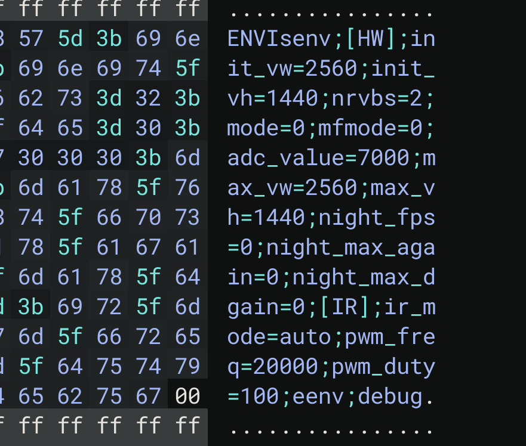
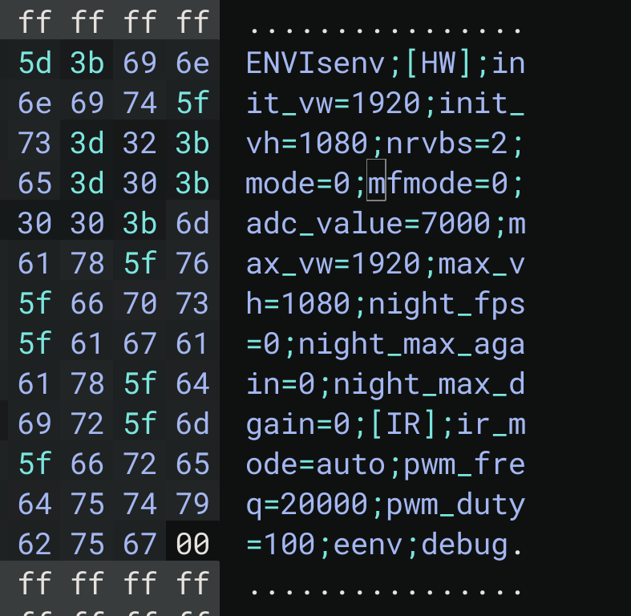
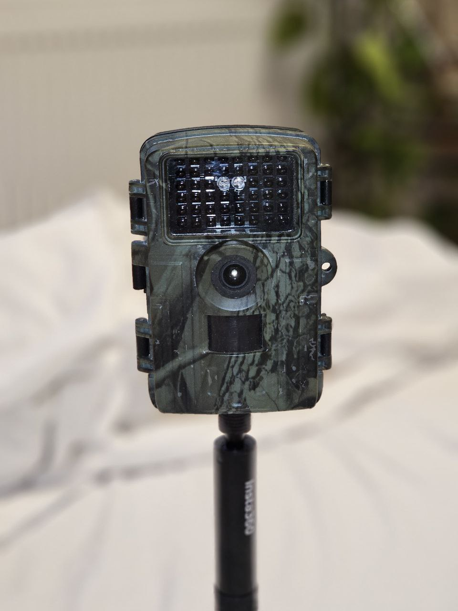
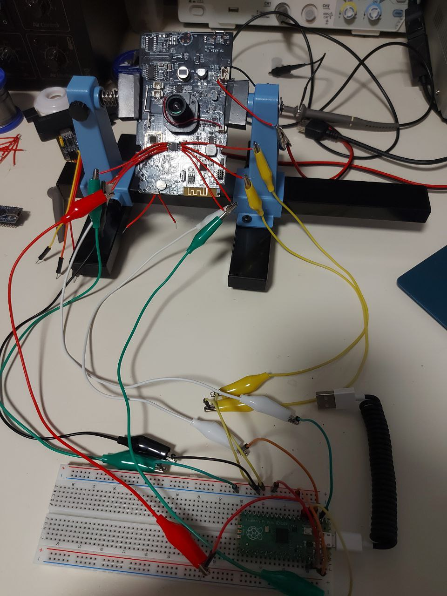
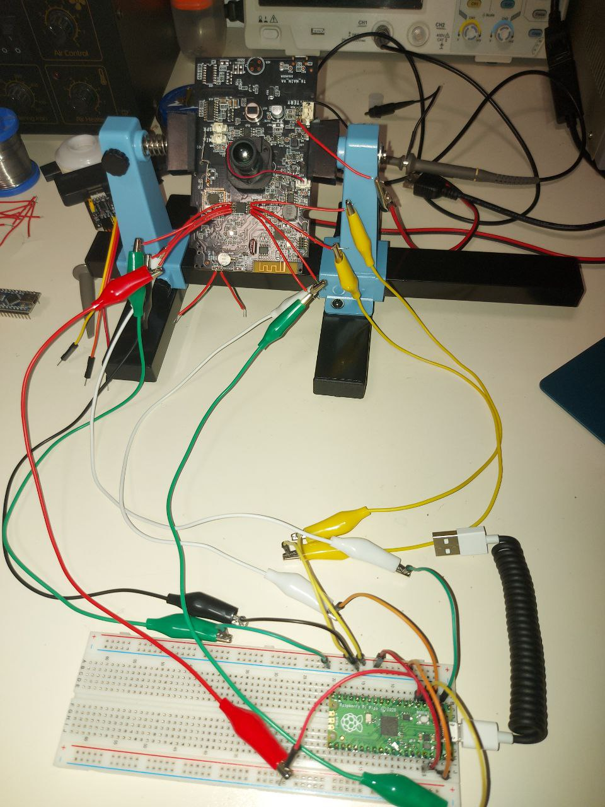
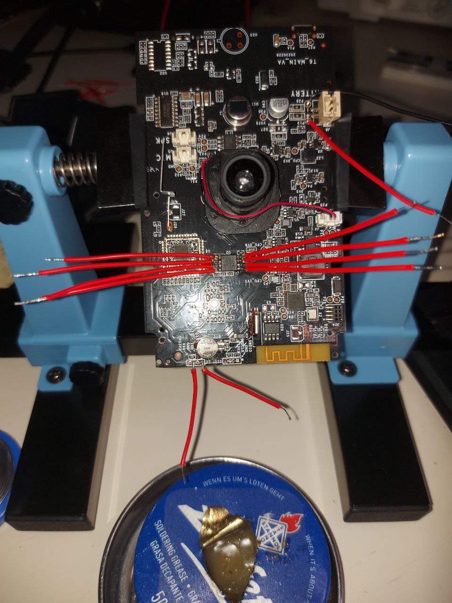
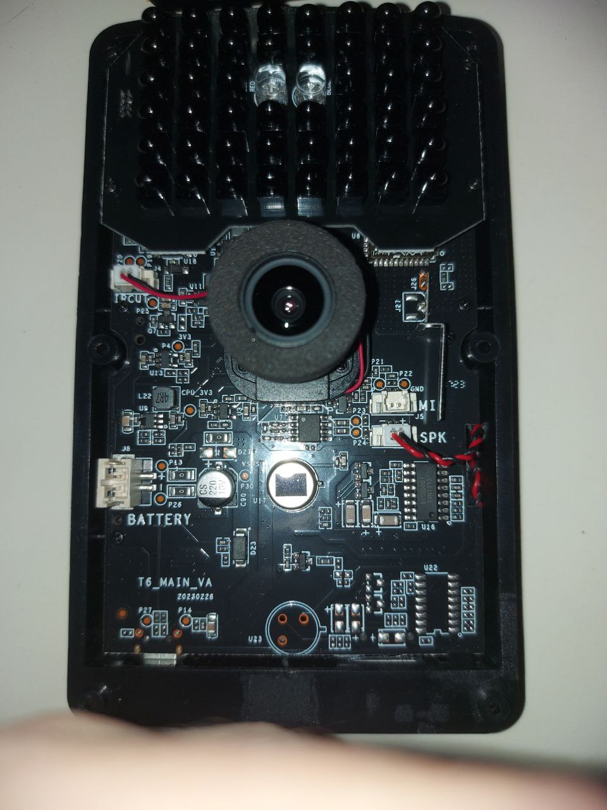
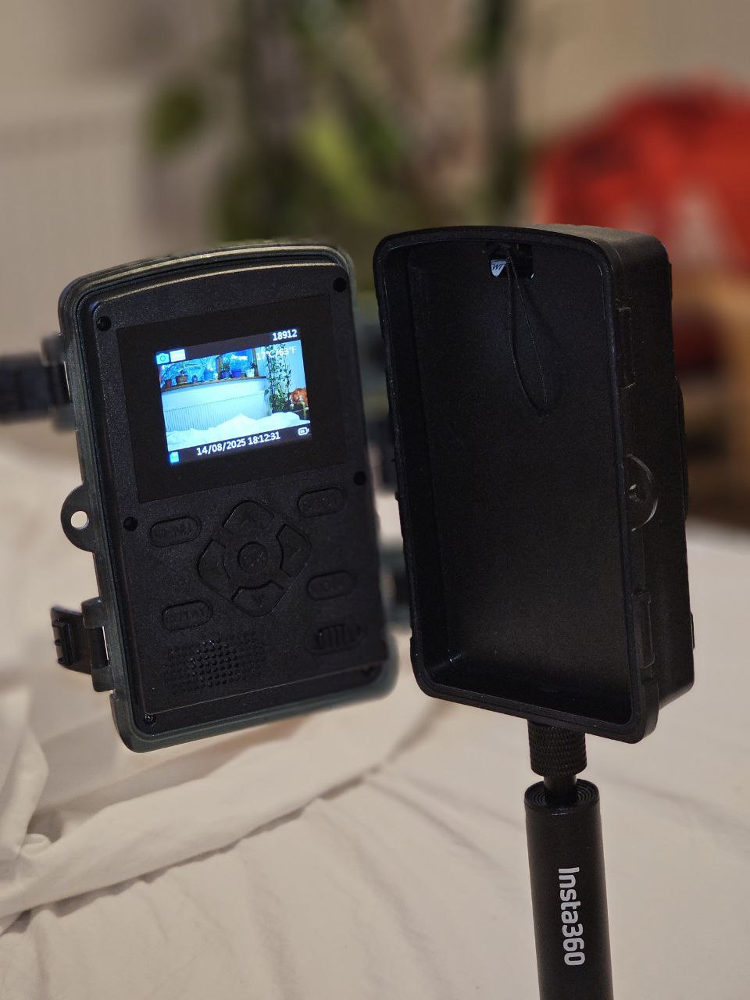

**Recovering and Repairing a Faulty Trail Camera Firmware**

*Overview*
This project began unintentionally after acquiring a second-hand trail camera that failed to power on. Investigation revealed that the device was running on a U-Boot bootloader with a Linux 3.10.14-Archon kernel (Linux/MIPS). The firmware exhibited a crash loop, restarting approximately every 8 seconds, making the device unusable.

## Initial Diagnostics

Hardware & Boot Output Analysis

Connected to the camera via UART to capture boot logs.

Confirmed U-Boot bootloader and Linux/MIPS architecture.

Firmware Access Attempts

Attempted brute-force password recovery for root access — unsuccessful.

Replacing the password hash in the firmware with a known hash enabled login after reflashing.

Partial Filesystem Recovery

Managed to scrape files from the root filesystem in short windows before the device restarted.

Retrieved Bluetooth and Wi-Fi driver binaries, but no login scripts were found.

## Root Cause Analysis
While examining firmware strings, I noticed configuration values related to image resolution. Prior research into the ISVP camera framework revealed that image resolution directly affects required memory allocation. A configuration file was requesting a resolution requiring more memory than the device had available, causing the main camera process to crash and trigger the watchdog reset.

## Solution

Extracted firmware and located resolution settings using a hex editor.

Reduced the resolution to match the device’s RAM capabilities.

Reflashed the modified firmware.

<table>
  <tr>
    <td align="center">
       
      Before
    </td>
    <td align="center">
       
      After
    </td>
  </tr>
</table>

## Result
The camera booted successfully without entering a crash loop, restoring full functionality.

## Key Technical Points

Low-level debugging via UART

Linux/MIPS firmware inspection

Direct binary patching via hex editing

Embedded system watchdog behavior analysis

  
  
  
  
  
  

